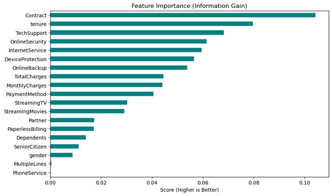
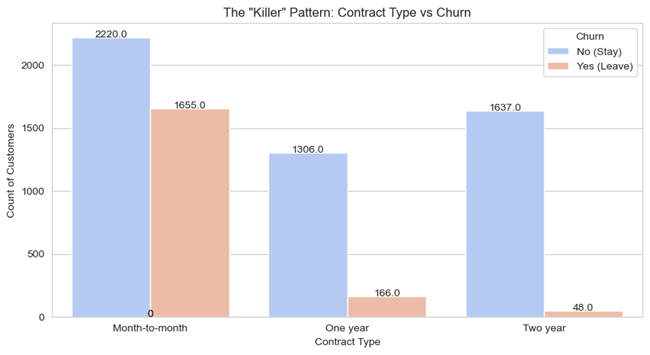

# 🕵️ The Churn Detective: Telco Customer Retention Strategy

### **Business Value: +$13,300 Monthly Revenue Impact**

## 📌 Executive Summary
**The Problem:** A Telecom client was facing high customer attrition (Churn) but lacked visibility into the root causes.

**The Solution:** I engineered an end-to-end data pipeline to diagnose churn drivers and built a predictive model to flag at-risk customers.

**The Impact:** The final Random Forest model achieved a **76% Recall Rate**, identifying **$13,300** more potential monthly revenue than the baseline model by optimizing for **Expected Value (ROI)** rather than simple accuracy.

---

## 📊 Key Insights & Visuals

### 1. The Root Cause: It's Not Price, It's Commitment
Using **Information Gain (Entropy)** analysis, I discovered that `Contract Type` was the #1 predictor of churn, overturning the stakeholder hypothesis that high prices were the main driver.

> *Insight: Month-to-month customers churn at >40%, while 2-year contract holders churn at <5%.*

### 2. The Strategic Pivot: Recall > Accuracy
In a dataset where 73% of customers stay, a "lazy" model is 73% accurate but worth $0. I optimized the model to prioritize **Recall** (Capture Rate) to minimize the cost of missed churners (False Negatives).

| Model | Accuracy | Recall (Capture Rate) | Net Profit (ROI) |
| :--- | :--- | :--- | :--- |
| **Baseline (Decision Tree)** | 76% | 63% | $73,450 |
| **Optimized (Random Forest)** | **74%** | **76%** | **$86,750** |

---

## 🛠️ The "Data Factory" Methodology
This project followed the **CRISP-DM** lifecycle:

1.  **Refinery (Data Cleaning):**
    * Detected and fixed hidden null values in `TotalCharges` (blank spaces).
    * Applied **One-Hot Encoding** for the predictive engine to avoid ordinality bias.
2.  **Lab (Exploratory Analysis):**
    * Utilized `mutual_info_classif` to detect non-linear signals that standard Correlation Matrices missed.
3.  **Engine (Modeling):**
    * **Algorithm:** Random Forest Classifier.
    * **Optimization:** Utilized `class_weight='balanced'` to handle the 73/27 class imbalance.
4.  **Audit (Evaluation):**
    * Implemented a custom **Profit Calculator** to translate Confusion Matrix outputs into financial metrics ($).

---

## 📂 Repository Structure
* `notebook/`: Contains the full analysis and modeling code.
* `data/`: The raw IBM Telco dataset.
* `images/`: Exported visualizations used in this ReadMe.
